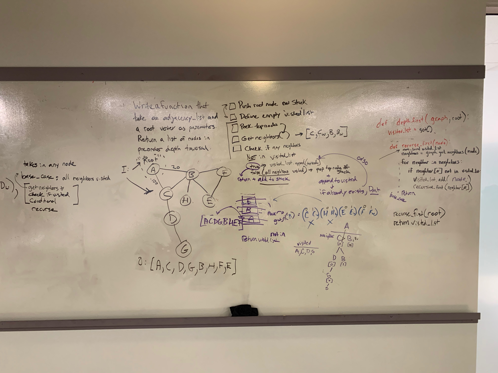

# Data Structures - Graph (Depth_First Traversal)

**Author**: Stephen Koch
**Version**: 1.0.0

### Overview
In this module, we are adding a traversal method to the Graph class created above this module. As the name states, this is a depth first traversal method.

### Approach & Efficiency
Depth first traversal works by using a stack. We start by adding the root node to the top of the call stack. As long as there are neighbors that have not been visited in the stack, we continue to add unvisited nodes to the stack. We pop off nodes from the stack when they cease to have unvisited children.

In this module we are taking advantage of the way using a function recursively uses the call stack. The call stack becomes our stack. And we invoke the recurse_traverse function inside of itself untill it reaches its base case - where there are no unvisited neighbors. At this base case we return and at that point it is "popped" off of the call stack.

For time and space this algorithm is O(N). We are creating a list of all nodes that were traversed (N) and we are calling the recurse_traverse function for each unvisited node (N nodes). 

### API
Our Graph now has eight public methods:

1. add_node(value): adds a new vertex to the graph, returns the added vertex  
2. add_edge(vertex1, vertex2, [weight]): adds new edge between two virtices, takes in two verticies, has ability to add weight  
3. get_nodes( ) - returns all of the vertices as a collection  
4. get_neighbors(vertex): returns a collection of vertices (with weights) connected to a vertex, takes in a vertex  
5. get_values(vertex): returns the value from a given vertex  
6. size( ) - returns number of vertices in Graph; integer
7. breadth_first(vertex): traverses the graph starting from the given vertex, returns a list of nodes visited during traversal  
8. depth_first(root_vertex): traverses the graph depth first starting from the given "root" vertex, returns a list of nodes visited during traversal

### Solution

## Other Data Structures
### 1. [Linked List](https://github.com/kochsj/python-data-structures-and-algorithms/tree/master/Data-Structures/linked_list) 2. [Stacks and Queues](https://github.com/kochsj/python-data-structures-and-algorithms/tree/stack-and-queue/Data-Structures/stacks_and_queues) 3. [Binary Tree](https://github.com/kochsj/python-data-structures-and-algorithms/tree/master/Data-Structures/tree) 4. [Hash Table](https://github.com/kochsj/python-data-structures-and-algorithms/tree/master/Data-Structures/hashtable) 5. [Graph](https://github.com/kochsj/python-data-structures-and-algorithms/tree/master/Data-Structures/graphs/breadth_first)

