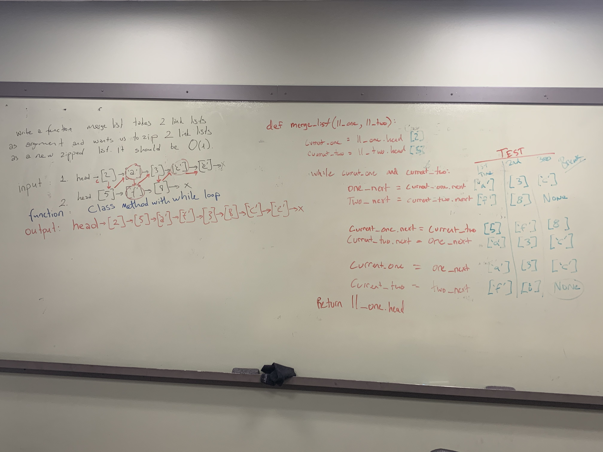

# Data-Structures-and-Algorithms - Challenge Five

# Merge - Linked Lists
### Problem domain
Write a function that takes two linked lists as arguements, zips the two linked lists together, and returns the zipped linked list. 
> inputs: head -> [1] -> [3] -> [2] -> X and head -> [5] -> [9] -> [4] -> X
outputs: head -> [1] -> [5] -> [3] -> [9] -> [2] -> [4] -> X  
### Challenge
Algorithm:
    1. Define a function that accepts two arguements (ll_one, ll_two)
    2. Returns reference to head of zipped linked lists
    3. Save the next property of each list node before reassigning (one_next and two_next)
    4. Reassign next property of first list's node to be the first node in the second list
    5. Reassign next property of the first node in the second list to be the saved one_next
    6. Move current_one and current_two reference to the saved values (one_next and two_next)
    7. Repeat while there is a current_one and current_two (have remaining values)
    8. Return reference to head
### Approach & Efficiency
For this challenge I worked with James. We set out to write a simple function (d.r.y) that matched the algorithm we determined beforehand. Using a while loop, we set out to repeat a three step process from our algorithm for as loing as there was a next node in **both** lists. 1)Save reference to the next node in each linked list 2)Assign next property to respective node 3)Change reference to the "current" node that we are working with. 

It appears that this algorithm would be O(1) performance.
### Solution

### Other Challenges
#### 1. Code Challenge One - [Array_Reverse](https://github.com/kochsj/python-data-structures-and-algorithms/challenges/array_reverse.py) 2. Code Challenge Two - [Array_Shift](https://github.com/kochsj/python-data-structures-and-algorithms/challenges/array_shift) 3. Code Challenge Three - [Array_Binary_Search](https://github.com/kochsj/python-data-structures-and-algorithms/tree/master/challenges/array_binary_search) 4. Code Challenge Four - [Linked List Merge](https://github.com/kochsj/python-data-structures-and-algorithms/tree/master/challenges/ll_merge) 5. Code Challenge Five - [Queue with Stacks](https://github.com/kochsj/python-data-structures-and-algorithms/tree/master/challenges/queue_with_stacks) 6. Code Challenge Six - [FIFO Animal Shelter](https://github.com/kochsj/python-data-structures-and-algorithms/tree/master/challenges/fifo_animal_shelter) 7. Code Challenge Seven - [FizzBuzz Tree](https://github.com/kochsj/python-data-structures-and-algorithms/tree/master/challenges/fizz_buzz_tree) 8. Code Challenge Eight - [Multiple Bracket Validation](https://github.com/kochsj/python-data-structures-and-algorithms/tree/master/challenges/multi_bracket_validation) 9. Code Challenge Nine - [Breadth-First Binary Tree Traversal](https://github.com/kochsj/python-data-structures-and-algorithms/tree/master/challenges/breadth_first_tree) 10. Code Challenge Ten - [Insertion Sort](https://github.com/kochsj/python-data-structures-and-algorithms/tree/master/challenges/insertion_sort) 11. Code Challenge Eleven - [Merge Sort](https://github.com/kochsj/python-data-structures-and-algorithms/tree/master/challenges/merge_sort) 12. Code Challenge Twelve - [Quick Sort](https://github.com/kochsj/python-data-structures-and-algorithms/tree/master/challenges/quick_sort)
