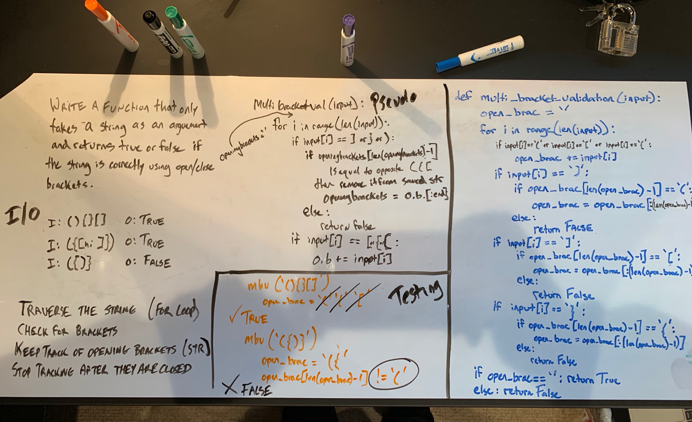

# Challenge - Multiple Bracket Validation

**Author**: Stephen Koch
**Version**: 1.0.0

### Overview
In this module, we are writing a function that, when given a string, can determine wither or not brackets are being opened and closed at the proper places. The function returns True or False based on correct bracket usage.

Example:
```
Input string: (){}[]
Output: True
```
```
Input string: ({[hello_world]}){}
Output: True
```
```
Input string: ({)}[]
Output: False
```

### Approach & Efficiency
For this module, the goal was to traverse the string that came into the function as input - for loop was used. Then conditionals were set up to check...<br>IF the character is an open bracket THEN add the character to a string of all the open brackets (open_brac variable).<br>IF the character is a closing bracket THEN check the end of the string (open_brac) and if the end of open_brac was the corresponding open bracket, continue the loop and remove the open bracket character from the open_brac string. 

The for loop continues for the length of the string. At the end, if all the conditions are met along the way, one last conditional is checked. If the open_brac string that was storing all the open bracket characters is now empty... that means that all of the brackets were opened and were closed. Only then can the function return True.

The BigO for this function is O(n) for both time and space. The entire input string is traversed each time the function is invoked. The bigger the input, the bigger the space and time.
 
### Solution:


### Other Challenges
#### 1. Code Challenge One - [Array_Reverse](https://github.com/kochsj/python-data-structures-and-algorithms/challenges/array_reverse.py)<br>2. Code Challenge Two - [Array_Shift](https://github.com/kochsj/python-data-structures-and-algorithms/challenges/array_shift)<br>3. Code Challenge Three - [Array_Binary_Search](https://github.com/kochsj/python-data-structures-and-algorithms/tree/master/challenges/array_binary_search)<br>4. Code Challenge Four - [Linked List Merge](https://github.com/kochsj/python-data-structures-and-algorithms/tree/master/challenges/ll_merge)<br>5. Code Challenge Five - [Queue with Stacks](https://github.com/kochsj/python-data-structures-and-algorithms/tree/master/challenges/queue_with_stacks)<br>6. Code Challenge Six - [FIFO Animal Shelter](https://github.com/kochsj/python-data-structures-and-algorithms/tree/master/challenges/fifo_animal_shelter)<br>7. Code Challenge Seven - [FizzBuzz Tree](https://github.com/kochsj/python-data-structures-and-algorithms/tree/master/challenges/fizz_buzz_tree)<br>8. Code Challenge Eight - [Multiple Bracket Validation](https://github.com/kochsj/python-data-structures-and-algorithms/tree/master/challenges/multi_bracket_validation)<br>9. Code Challenge Nine - [Breadth-First Binary Tree Traversal](https://github.com/kochsj/python-data-structures-and-algorithms/tree/master/challenges/breadth_first_tree)<br>10. Code Challenge Ten - [Insertion Sort](https://github.com/kochsj/python-data-structures-and-algorithms/tree/master/challenges/insertion_sort)<br>11. Code Challenge Eleven - [Merge Sort](https://github.com/kochsj/python-data-structures-and-algorithms/tree/master/challenges/merge_sort)<br>12. Code Challenge Twelve - [Quick Sort](https://github.com/kochsj/python-data-structures-and-algorithms/tree/master/challenges/quick_sort)<br>13. Code Challenge Thirteen - [Repeating Word Search](https://github.com/kochsj/python-data-structures-and-algorithms/tree/master/challenges/repeated_word)


