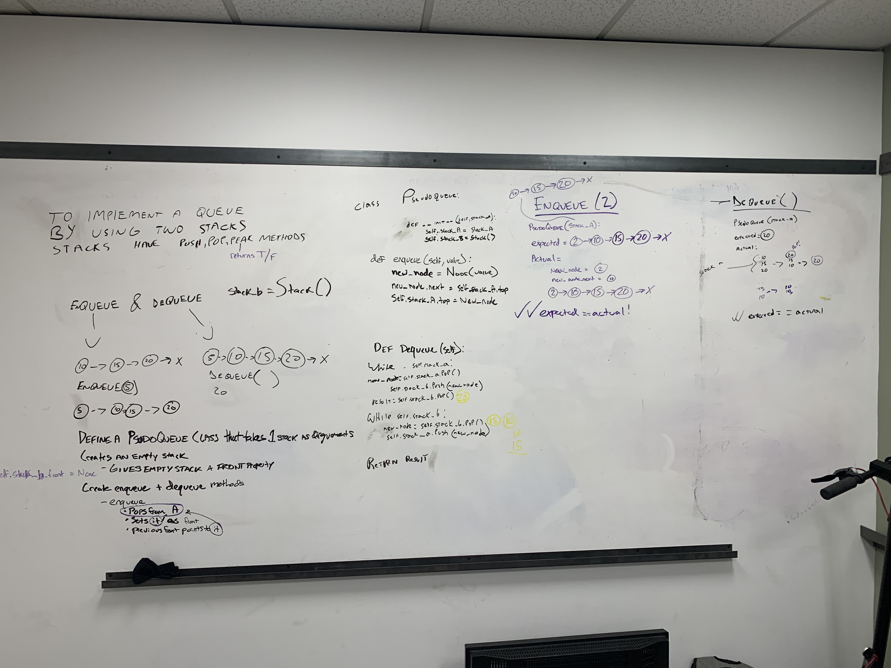

# Challenge - Queue from Stacks

**Author**: Stephen Koch
**Version**: 1.0.0

## Overview
In this module, queues are 'created' using two stacks. Nodes are enqueued and dequeued to the pseudo queue instance.

Stacks and queues are a collection of nodes - Each in different orientation. 

Stacks are like a stack of plates. The first node being both the top and the bottom. The first stays as the 'bottom' or end. Each node added after makes the newest node the 'top'. Again, like a stack of plates, adding to the top of the stack. Stacks have a top property to keep track of what 'plate' is on top.

Queues are like a line at a bank. The first node being the front of the queue and the end of the queue (line). As nodes are added, they are 'enqueued' and join the line. The new node is now the end of the queue and the first node is still the front of the queue. Each additional node becomes the end of the queue as the 'line' gets longer. When dequeuing from the queue, the front node is removed and the 'next in line' then becomes the front of the queue. Just like standing in line at a bank.

The pseudo queue class uses two stacks to mimic the behavior of a queue when adding to the queue and taking away from the queue.

## Functionality/Architecture
This application is creating instances of Stacks, Nodes, and PseudoQueues.

Creating - When an instance of a stack is created, it is created without any nodes i.e an empty stack. A PseudoQueue instance is created by passing a stack as an arguement. Nodes can be created and added by using the push method of the Stack instance. By passing in a value as an arguement for the node, these methods define the 'next' node.

Push(stack) - Pushing to a stack adds a node to the top of the stack. The top property of the Stack instance is now set to the newly created node on the top. The next property of that new node is set to the previous top of the stack. O(1) performace

Enqueue(PseudoQueue) - In general, enqueuing to a queue adds a node to the end of the queue. It keeps reference to the previous end of the queue. It makes the previous end point to the new node. The end property of the queue points to the new node. The new node points to none. In the case of the PseudoQueue, enqueuing is adding to the top of the first stack; which is the 'end' of our pseudo queue.

Removing - Both the stack and PseudoQueue classes have methods to remove nodes. Stacks can pop nodes off of the top of the stack. The PseudoQueue (like queues)can dequeue nodes from the front of the 'queue'.

Pop(stack) - Popping off of a stack targets the top property of the Stack instance. The next node in the stack becomes the new top. The top's next property is set to None, effectively removing it from the stack. O(1) performace

Dequeue(queue) - In general, what we want to do when dequeuing from a queue, is to remove the front node from the queue. The next property of the front node is set to None. The front of the queue now points to the previous front's next node. In this case, with the PseudoQueue, we want to 'flip' the first stack by popping off all of the first stacks values and pushing them to the second stack. Flipping them. Now when we pop off of the stack, the 'front' node is removed from the 'queue'. 

Peek(stack) - Stacks have a peek method. The peek method looks at the top of the Stack with O1 performance. Peek returns the value of the top node.

## Solution

## Other Challenges
### 1. Code Challenge One - [Array_Reverse](https://github.com/kochsj/python-data-structures-and-algorithms/challenges/array_reverse.py) 2. Code Challenge Two - [Array_Shift](https://github.com/kochsj/python-data-structures-and-algorithms/challenges/array_shift) 3. Code Challenge Three - [Array_Binary_Search](https://github.com/kochsj/python-data-structures-and-algorithms/tree/master/challenges/array_binary_search) 4. Code Challenge Four - [Linked List Merge](https://github.com/kochsj/python-data-structures-and-algorithms/tree/master/challenges/ll_merge) 5. Code Challenge Five - [Queue with Stacks](https://github.com/kochsj/python-data-structures-and-algorithms/tree/master/challenges/queue_with_stacks) 6. Code Challenge Six - [FIFO Animal Shelter](https://github.com/kochsj/python-data-structures-and-algorithms/tree/master/challenges/fifo_animal_shelter) 7. Code Challenge Seven - [FizzBuzz Tree](https://github.com/kochsj/python-data-structures-and-algorithms/tree/master/challenges/fizz_buzz_tree) 8. Code Challenge Eight - [Multiple Bracket Validation](https://github.com/kochsj/python-data-structures-and-algorithms/tree/master/challenges/multi_bracket_validation) 9. Code Challenge Nine - [Breadth-First Binary Tree Traversal](https://github.com/kochsj/python-data-structures-and-algorithms/tree/master/challenges/breadth_first_tree) 10. Code Challenge Ten - [Insertion Sort](https://github.com/kochsj/python-data-structures-and-algorithms/tree/master/challenges/insertion_sort) 11. Code Challenge Eleven - [Merge Sort](https://github.com/kochsj/python-data-structures-and-algorithms/tree/master/challenges/merge_sort) 12. Code Challenge Twelve - [Quick Sort](https://github.com/kochsj/python-data-structures-and-algorithms/tree/master/challenges/quick_sort) 13. Code Challenge Thirteen - [Repeating Word Search](https://github.com/kochsj/python-data-structures-and-algorithms/tree/master/challenges/repeated_word) 14. Code Challenge Fourteen - [Tree Intersection](https://github.com/kochsj/python-data-structures-and-algorithms/tree/master/challenges/tree_intersection)

