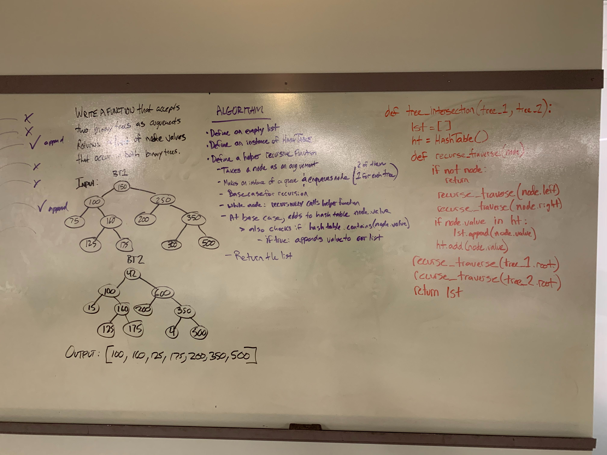

# Data-Structures-and-Algorithms - Challenge Fourteen

# Tree Intersection
### Problem domain
This challenge asks us to write a function that takes two strings as arguments and returns a list of the elements that both trees have in common.

### Challenge
Traverse both trees keeping track of the values in each. Return a list of the elements that they have in common.
```
State of a given tree_one:      State of a given tree_two:
      root: [2]                         root: [12]                           
           /   \                             /   \
         [5]   [25]                         [7]   [55]
        /  \      \                       /  \      \
      [6]  [0]     [9]                  [2]  [6]     [100]
          /  \     /                   /   \    \
        [4]  [11] [100]               [5]   [4]   [0]
```
```Returns a list: [2, 6, 100, 5, 4]```

### Approach & Efficiency
The approach here is to define a helper function that we can use to invoke recursively to traverse all of the nodes in each tree and add their values to a hash table. A hash table is good in this situation because when we need to check each node for IF that node is already in a collection... a hash table has O(1) time complexity to check. As apposed another O(n) implication with a list.

We are passing a boolean into the tree_intersection recursive helper function that tells it when to check a conditional. After all of the nodes in tree one are checked and their values are added to our hash table, then we pass in True. True gets passed throughout the recursive traversal and checks if the node values are included in the hash table.

The efficency here breaks down to is O(N) for time (all nodes) and O(N) for space. The O(1) for time using a hash table to check if any value is included saves us here. As if the lookup was not O(1) we would be looking at at least O(n^2) for time.

### Solution



### Other Challenges
#### 1. Code Challenge One - [Array_Reverse](https://github.com/kochsj/python-data-structures-and-algorithms/challenges/array_reverse.py)<br>2. Code Challenge Two - [Array_Shift](https://github.com/kochsj/python-data-structures-and-algorithms/challenges/array_shift)<br>3. Code Challenge Three - [Array_Binary_Search](https://github.com/kochsj/python-data-structures-and-algorithms/tree/master/challenges/array_binary_search)<br>4. Code Challenge Four - [Linked List Merge](https://github.com/kochsj/python-data-structures-and-algorithms/tree/master/challenges/ll_merge)<br>5. Code Challenge Five - [Queue with Stacks](https://github.com/kochsj/python-data-structures-and-algorithms/tree/master/challenges/queue_with_stacks)<br>6. Code Challenge Six - [FIFO Animal Shelter](https://github.com/kochsj/python-data-structures-and-algorithms/tree/master/challenges/fifo_animal_shelter)<br>7. Code Challenge Seven - [FizzBuzz Tree](https://github.com/kochsj/python-data-structures-and-algorithms/tree/master/challenges/fizz_buzz_tree)<br>8. Code Challenge Eight - [Multiple Bracket Validation](https://github.com/kochsj/python-data-structures-and-algorithms/tree/master/challenges/multi_bracket_validation)<br>9. Code Challenge Nine - [Breadth-First Binary Tree Traversal](https://github.com/kochsj/python-data-structures-and-algorithms/tree/master/challenges/breadth_first_tree)<br>10. Code Challenge Ten - [Insertion Sort](https://github.com/kochsj/python-data-structures-and-algorithms/tree/master/challenges/insertion_sort)<br>11. Code Challenge Eleven - [Merge Sort](https://github.com/kochsj/python-data-structures-and-algorithms/tree/master/challenges/merge_sort)<br>12. Code Challenge Twelve - [Quick Sort](https://github.com/kochsj/python-data-structures-and-algorithms/tree/master/challenges/quick_sort)<br>13. Code Challenge Thirteen - [Repeating Word Search](https://github.com/kochsj/python-data-structures-and-algorithms/tree/master/challenges/repeated_word)<br>14. Code Challenge Fourteen - [Tree Intersection](https://github.com/kochsj/python-data-structures-and-algorithms/tree/master/challenges/tree_intersection)
